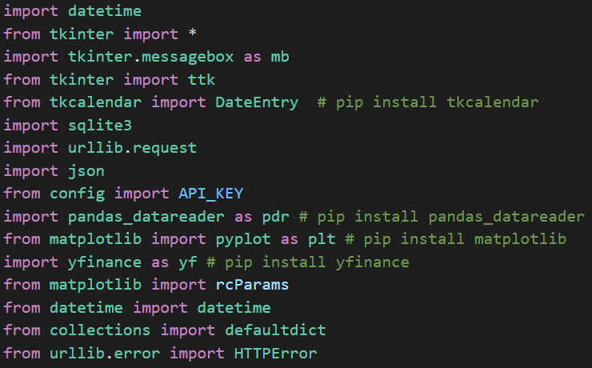

# **Devang Bafna & Ziya Aydin: Easy Budget**

# **User Instructions**

*
1. Please refer to the image below and follow the instructions given.
*

*
2. Next step is to download the Python extension in Visual Studio Code.
*
*
3. Once this is set, proceed to the GitHub link found here.
*
*
4. Click the green button called 'Code' and click download zip.
*
*
5. Extract the zip and store the folder in another location.
*
*
6. Through visual studio code, proceed to 'Open Folder' and voila, you have gotten the code.
*
*
7. Now looking at the image below, these are the libraries required to run main_code.py
*
*
8. Out of which, only 4 libraries (tkcalendar, pandas_datareader, matplotlib, yfinance) need to be installed as everything else is pre-installed.
*

*
9. Once these libraries have been installed and Visual Studio Code does not show any errors, we are good to go!
*
*
10. Click the run icon (angled triangle) in the top right for main_code.py to run.
*
*
11. If successful, a login page asking for a username and password will appear.
*
*
​12. For the first login, the username is testuser, the password is testpassword, the budget is $500 (Default), and the location is Wellesley (Default).
*
*
13. Afterwards, the user is given the choice to update their username, password, budget, and location (right side of main menu).
*
*
14. The user is now free to use the features in Easy Budget such as add expense, delete expense, view stock prices, view spending by category or months, and get real-time temperatures in their location.
*
*
15. If username or password is updated/changed, the next time the user can sign in with these updated credentials.
*
*
16. And there we go, the user can now use Easy Budget with ease!
*

